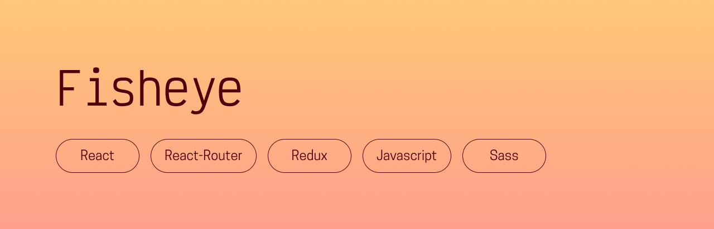

## Presentation
Fisheye is a fictional platform for freelance photographers. This was originally project 6 of my OpenClassrooms front-end development program, made with HTML and CSS – I decided to give it a fresh coat of paint with my new skills and remake it using React, Redux and Sass !

## Prerequisites
- [NodeJS (version 16.17.0)](https://nodejs.org/en/)
- [NPM (version 9.4.0)](https://www.npmjs.com/)

## Getting started
- Run `$ npm install` to install all dependencies
- Run `$ npm start` to see the project!

## Thanks for reading, and happy coding!  
Chloé Adrian